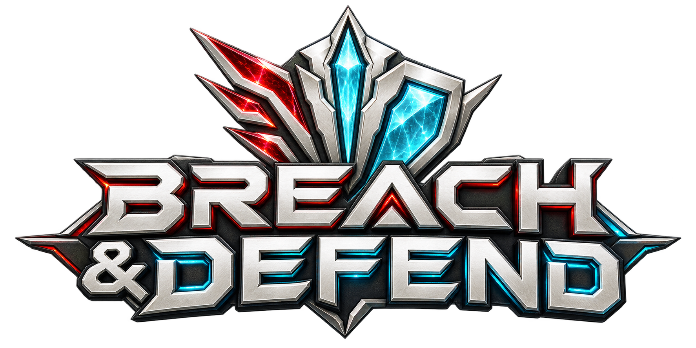

  <a href="https://breach.cards/"><strong>Play now at breach.cards</strong></a>

  
  
  

# Breach & Defend

A red-versus-blue card game for learning cybersecurity, inspired by classic trading-card game mechanics. Play red or blue against a local computer opponent, or against a friend through an invite link. Every card teaches a real security concept, from phishing and lateral movement to backups and MFA.

No install, account, or build step: it's plain HTML, CSS and JavaScript modules.

## Included

- 100 original card designs across two sets: First Breach (50) and the opt-in Persistent Threats expansion (50), plus two tokens.
- Fixed, public 60-card decks: two First Breach starters, and two Persistent Threats decks that mix both sets.
- An original illustration and a security lesson on every card and token.
- Original daylight battlefield, two transparent faction emblems, and two faction card backs used on deck piles and 3D flip animations.
- Opening-hand mulligans; one infrastructure per turn; automatic resource payment; turn phases; priority and a last-in-first-out effect stack.
- Attacking, blocking, multiple blockers, simultaneous damage, new-arrival delay, Rapid deploy, Always-on, Stealth, Detection, Recharge, Overflow, and Firewall.
- Target validation, counterspells, temporary modifiers, discard and recovery, defeat at zero capacity, and deck-out losses.
- Opt-in interactive first-play tutorial, quick tips, searchable card library, field guide, and match recap with security lessons.
- Responsive layout and native keyboard-operable buttons and dialogs.
- Animated hover and keyboard-focus previews for hand cards, opening hands, and the card library, with specific explanations when a card cannot be played.

## Run locally

Install Node.js 22 or newer, then run `npm start` (or `node serve.cjs`) from this directory. Open the printed local URL. No npm dependencies, remote AI service, or API key is required. The game uses JavaScript modules and should be served over HTTP rather than opened as a file.

Run the rule and tutorial checks with `npm test`.

## Deployment

The workflow in `.github/workflows/pages.yml` runs all tests using Node.js 24 and publishes only `public/`. It runs automatically on pushes to `main`, or manually from **Actions → Publish game to GitHub Pages → Run workflow**. Only runs on `main` can deploy.

To deploy your own fork, select **Settings → Pages → Build and deployment → Source → GitHub Actions**. No secrets, dependency installation, or build command are required. Relative asset paths support GitHub Pages repository URLs.

See [GitHub’s custom Pages workflow documentation](https://docs.github.com/en/pages/getting-started-with-github-pages/using-custom-workflows-with-github-pages) for repository configuration.

## Guided first game

Check **Guide my first game** before choosing either faction. It starts unchecked and is never enabled automatically for later matches. Six lessons track keeping a hand, playing infrastructure, deploying a unit, passing or responding, attacking, and defending. Highlighted cards and controls show what to do next; lessons advance from actual game actions.

The guide pauses your first pending-effect priority window so you can read before passing. It adapts to your real hand and available moves, so lessons may span several turns or occur in a different order. **Exit tutorial** is available on the board and in card dialogs and continues the same match without guidance. Existing quick tips and the field guide remain available independently.

## Persistent Threats

Tick **Include Persistent Threats** on the start screen, or when inviting a friend, to play the expansion. Both players use decks that mix First Breach and Persistent Threats cards. The expansion adds Probe, Overclock and Reuse, the Backdoor and Indicator tokens, retiring, the archive, triggered abilities and in-match choices; the Field Guide explains each, and quick tips in expansion matches point them out as they come up. The guided first game always uses First Breach.

## Browse and play cards

Hover a visible card in your hand, opening hand, either battlefield, or card library to lift out an enlarged preview with its full rules, cost, stats, and keyword explanations. Tab focus also opens previews; Escape dismisses them. Previews stay within the screen edges and respect reduced-motion preferences. Clicking still opens the card details and play options; touch players can continue to tap cards.

Drag a card from your hand (or its enlarged preview) onto **Your battlefield** to play it. The battlefield highlights while dragging; blocked cards explain their unmet requirements. Cards needing a target open the target picker before payment. Release elsewhere or press Escape to cancel. Horizontal touch swipes still scroll the hand; tap-to-play and keyboard controls remain available.

Hand previews and card details show every unmet play requirement, including required versus ready compute, main-phase timing, priority, pending effects, and the specific kind of missing target. These explanations use the same checks that validate playing the card and update with the current match state.

## Play a friend

On the arena start screen, choose **Play a friend**, pick your side and send the link to your opponent. They play the other faction. Both players accept a short honor pledge, then a fair coin flip, made from secrets both browsers contribute, decides who goes first.

- **Connection:** Browsers connect directly with WebRTC through the free public PeerJS signaling server. No accounts, keys or backend are required, so this works on GitHub Pages. Some corporate or mobile networks block direct connections; there is no relay server.
- **Clocks:** 60 seconds to keep an opening hand, 90 seconds per turn, and 20 seconds per response. When time runs out the game passes, skips attacks or blocks, or discards the costliest cards for you.
- **Reconnecting:** Either player can reload or lose connection and continue. The match pauses, including the clocks, until both are back. Leaving the match concedes.
- **Fair play:** The host's browser runs the rules. The guest never receives hidden cards, so the guest cannot cheat. When the match ends, the guest's browser replays every move from the revealed seed and the recap shows **Verified**, **Tampering detected**, or **Unverified**. Tampering with decks, hands or capacity is caught, and so is a timeout recorded for the guest before the guest's own clock ran out (within a 5-second allowance for network delay). Peeking at the other hand is not, which is what the honor pledge is for.

## Deliberate simplifications

This is not a full implementation of any existing card game’s rules. Compute is one generic resource and is paid automatically. Start-of-turn gains resolve automatically without triggered-ability responses. Combat damage is assigned automatically in the order blockers were assigned, lethal damage first. No multiple resource types, sideboards, deck editor, or saved computer matches are included. Reloading resets a computer match.

The computer uses a local heuristic. It knows its own hand and the public battlefield, not the player's hidden cards. The user always takes the first turn. Starter balance and the 15–25 minute target duration need human playtesting.

## Validation

`npm test` covers the rules, including 100 seeded complete matches with card-count conservation and no deadlocks, plus tutorial opt-in, exit, progression for both factions, unavailable moves, and early match endings. The simulation uses different policies for the two players and is a correctness check, not proof of competitive balance. Tutorial browser checks cover the unchecked default, both factions, mulligans, resource play, unit casting, priority, desktop/mobile layout, and exiting with mouse and keyboard. Versus tests cover the seeded RNG, save/restore, redaction and perspective flipping, the referee, clocks, the replay audit (including five tampering kinds), storage fallbacks, and complete host/guest matches over an in-memory transport with reloads, dropped connections, impostor hosts and a third player. Landing-page tests check both modes' controls and that the web-sized splash images exist.

## Source layout

- `public/cards.mjs`: card definitions, lessons, deck lists, and keyword glossary.
- `public/persistent-threats.mjs`: Persistent Threats card definitions.
- `public/rules.mjs`: triggers, costs, choices and effects.
- `public/lore.mjs`: flavor and learning texts.
- `public/prepare.mjs`, `choices.mjs`, `expansion-view.mjs`, `expansion-tips.mjs`: the expansion interface.
- `art-source/cards/*/generation-prompts.json`: image prompts.
- `public/engine.mjs`: rules and computer strategy, independent of the interface.
- `public/app.mjs`: UI state, event handling, match flow, and optional WebMCP tools.
- `public/card-view.mjs`, `arena-view.mjs`, `library.mjs`, `guide.mjs`: card, arena, dialog, library and field-guide markup, as pure functions of the UI state. `html.mjs` holds the shared `esc`.
- `public/landing.mjs`: start screen with the splash hero and the game-mode selector. The original splash art lives in `art-source/`; `public/art/splash-*` are the web sizes.
- `public/protocol.mjs`, `rng.mjs`, `match.mjs`, `audit.mjs`, `remote.mjs`, `session.mjs`, `net.mjs`, `storage.mjs`, `versus-ui.mjs`: play-a-friend (shared rules, host referee, audit, guest seat, sessions, PeerJS transport, storage, markup).
- `public/tutorial.mjs`: lesson progress and contextual guidance, independent of rendering.
- `public/tutorial.css`: opt-in panel, lesson checklist, and action highlights.
- `public/card-preview.mjs` and `public/card-preview.css`: hover/focus preview interactions and positioning.
- `public/card-drag.mjs` and `public/card-drag.css`: hand-to-battlefield dragging and drop feedback.
- `public/style.css`: layout and visual design.
- `public/art/`: generated artwork used by the cards.
- `docs/art-prompts/`: exact final prompts used to generate the artwork and logo.
- `tests/engine.test.mjs`: rules and match simulation checks.
- `tests/tutorial.test.mjs`: tutorial progression against the real rules engine.
- `tests/playability.test.mjs` and `tests/card-preview.test.mjs`: play-requirement explanations and preview placement.

## Learning references

Card effects are simplified game mechanics, not technical instructions or universal guarantees. Useful primary references are linked in the field guide:

- https://www.cisa.gov/stopransomware/ransomware-guide
- https://www.cisa.gov/sites/default/files/2023-01/fact-sheet-implementing-phishing-resistant-mfa-508c.pdf
- https://www.cisa.gov/news-events/cybersecurity-advisories/aa23-278a

## Contributing

Bug reports, playtest feedback, card ideas and pull requests are welcome. See [CONTRIBUTING.md](CONTRIBUTING.md) and the [Code of Conduct](CODE_OF_CONDUCT.md). Report security issues privately as described in [SECURITY.md](SECURITY.md).

## License

- **Code** is licensed under the [MIT License](LICENSE).
- **Artwork, logo, and card content** are licensed under [CC BY-NC 4.0](LICENSE-ASSETS.md): free to share and adapt with credit, but not for commercial use.

Breach & Defend is an independent educational game by [Frode Hus](https://www.frodehus.dev), inspired by classic trading-card game mechanics. Card designs are original and illustrations are AI-generated. The source does not include third-party card images, symbols, or frames.
